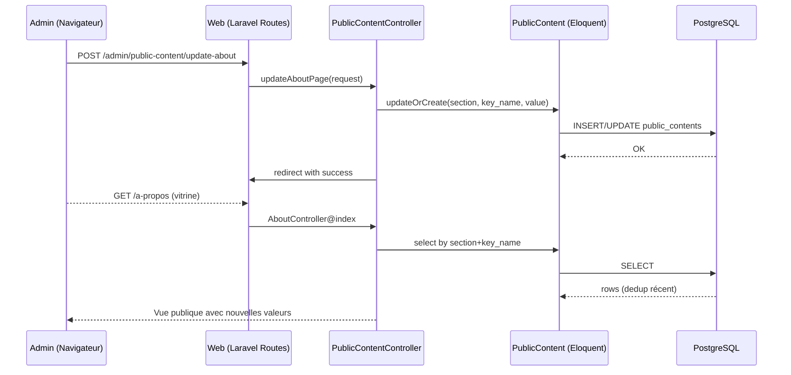
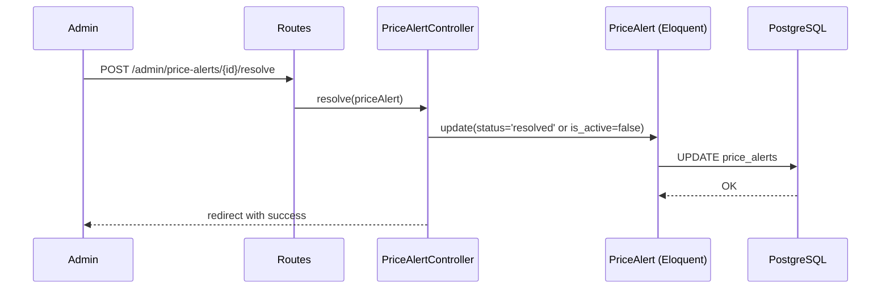
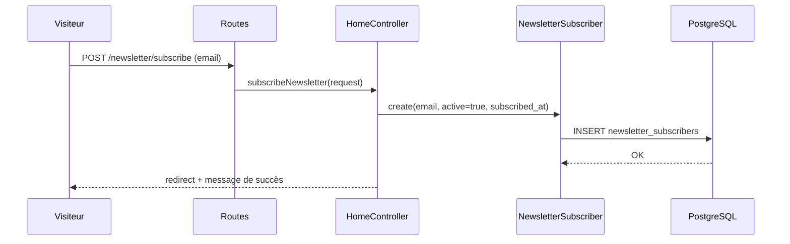
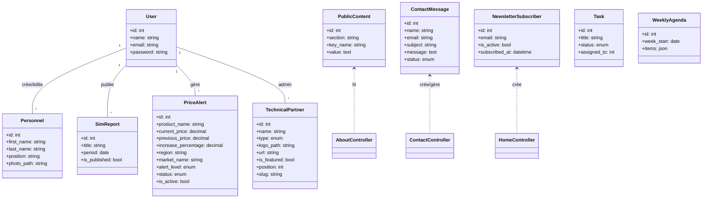

# Conception du Système, Diagrammes et Processus SIG

Ce document présente la conception fonctionnelle et technique de la plateforme CSAR, les principaux diagrammes (cas d'utilisation, séquences, classes), la liste des outils/langages/matériels utilisés, ainsi que la description détaillée du processus SIG (de la conception à l'intégration des données fiscales et cartographiques).

## 1) Outils, langages et matériels

- Outils backend
  - Laravel 11 (framework PHP)
  - Composer (gestion des dépendances)
  - DomPDF (génération de PDF)
  - Artisan (CLI Laravel: migrations, caches, routes)
  - Eloquent ORM (accès aux données)
- Outils frontend
  - Blade (templating)
  - Bootstrap 5 et utilitaires Tailwind (styles)
  - jQuery (interactions légères), DataTables (tableaux dynamiques)
  - Icons: Font Awesome
- Base de données
  - PostgreSQL (production)
  - SQLite (développement rapide / tests)
  - Option SIG: PostGIS (extension spatiale PostgreSQL) — recommandé pour l'analyse et les jointures spatiales
- SIG / Carto (côté web)
  - Leaflet (bibliothèque cartographique web) ou MapLibre GL
  - Fonds de plan: OpenStreetMap / MapTiler
  - Outils ETL: QGIS, ogr2ogr, Python (pandas/geopandas) pour la préparation de données
- Déploiement
  - Apache ou Nginx
  - PHP-FPM 8.2+
  - Certbot (Let's Encrypt) pour SSL
  - Supervisor (si on active les files d'attente)
- Matériels (profil minimal conseillé)
  - Développement: PC avec 8 Go RAM, CPU 4 coeurs, SSD, Windows 10/11 avec XAMPP
  - Production: VM 2 vCPU, 4–8 Go RAM, SSD, Ubuntu 22.04 LTS, PostgreSQL managé ou local

## 2) Diagramme de cas d'utilisation (principaux)

```mermaid
usecaseDiagram
actor "Visiteur" as Visitor
actor "Administrateur" as Admin

rectangle CSAR {
  Visitor --> (Consulter la page d'accueil)
  Visitor --> (Voir les partenaires)
  Visitor --> (S'abonner à la newsletter)
  Visitor --> (Envoyer un message de contact)
  Visitor --> (Consulter SIM / Rapports publics)

  Admin --> (Gérer le contenu public)
  Admin --> (Gérer le personnel)
  Admin --> (Exporter fiches PDF)
  Admin --> (Gérer partenaires techniques)
  Admin --> (Gérer newsletter)
  Admin --> (Gérer messages de contact)
  Admin --> (Gérer rapports SIM)
  Admin --> (Gérer alertes de prix)
  Admin --> (Gérer tâches et agenda)
}
```

## 3) Diagrammes de séquence (exemples clés)

### 3.1 Mettre à jour la page « À propos » (Admin)


### 3.2 Résoudre une alerte de prix (Admin)


### 3.3 Abonnement à la newsletter (Public)


## 4) Diagramme de classes (simplifié)



## 5) Conception SIG: du développement à l'intégration des données fiscales et cartographiques

Cette section décrit le processus SIG mis en place pour les modules « SIM » et l'affichage cartographique public.

### 5.1 Objectifs SIG
- Consolider des données de marchés, régions et prix pour l'analyse spatio-temporelle
- Visualiser la distribution spatiale (points de marchés, entrepôts, opérations)
- Produire des indicateurs par région (choroplèthes) et détecter des hausses anormales (alertes de prix)
- Intégrer des données fiscales si pertinent (zones fiscales, codes, recettes agrégées) pour corrélation territoriale

### 5.2 Modèle de données (logique)
- Référentiels
  - Regions (code, nom, géométrie)
  - Marches (id, nom, commune, region_code, coordonnées)
- Faits/Observations
  - Prix (date, produit, marché, prix courant, prix précédent)
  - AlertePrix (produit, marché, région, pourcentage hausse, niveau, statut)
- Données fiscales (optionnel)
  - ZoneFiscale (code, géométrie)
  - RecetteFiscale (période, zone_fiscale_code, montant)

### 5.3 Stockage et schéma
- PostgreSQL + PostGIS (recommandé)
  - Tables référentielles: regions, marches
  - Tables de faits: prix, price_alerts (déjà existante), sim_reports
  - Colonnes géométriques: geometry(Point, 4326) pour marchés; geometry(MultiPolygon, 4326) pour régions/zones
  - Index spatiaux (GIST) sur les colonnes geometry

### 5.4 Préparation et intégration des données
- Collecte
  - Shapefiles GeoJSON/TopoJSON des régions (source: admin boundaries)
  - Liste des marchés + coordonnées (CSV/Excel) ou géocodage (Nominatim) si coordonnées manquantes
  - Données de prix (CSV périodiques, API, fichiers SIM internes)
  - Données fiscales (CSV/Excel selon l'administration fiscale locale ou service concerné)
- Normalisation
  - Nettoyage via Python (pandas/geopandas) ou QGIS
  - Harmonisation des codes (region_code, zone_fiscale_code)
  - Projection en EPSG:4326 (WGS84) pour le web
- Chargement (ETL)
  - ogr2ogr pour charger des shapefiles/GeoJSON en PostGIS
  - COPY (psql) pour insérer les CSV de prix/fiscalité
  - Scripts artisan command (optionnel) pour ingérer des fichiers déposés dans storage/app/import

### 5.5 Logique applicative (backend)
- Contrôleurs publics `SimController` et rapports `SimReportController`
  - Endpoints pour listes de prix, agrégations par région, périodes
  - Génération d'alertes: calcul du pourcentage d'augmentation par produit/marché (trigger manuel depuis admin ou CRON)
- Jointures spatiales (si PostGIS)
  - `SELECT r.name, SUM(p.montant) FROM recettes p JOIN zones r ON ST_Contains(r.geom, p.geom) ...`
  - Agrégations par région pour alimenter les cartes choroplèthes

### 5.6 Front cartographique (Leaflet/MapLibre)
- Fonds de plan OSM
- Couches
  - Points: marchés/entrepôts (marker clustering, popup: prix récents)
  - Polygones: régions (colorisation par indicateur: moyenne prix, variations)
- Interactions
  - Filtres (produit, période, région)
  - Légende dynamique, info-hover, sélection de zone
  - Mode « alertes »: surbrillance des marchés avec hausse > X%

### 5.7 Intégration des données fiscales
- Schéma
  - Table `zone_fiscale` (code, nom, geom)
  - Table `recette_fiscale` (période, code_zone, montant)
- Processus
  - Import recettes (CSV) → normalisation des codes → insertion
  - Jointure spatiale zone_fiscale ↔ régions/communes si nécessaire
  - Exposition des agrégats via endpoints JSON (période, zone, indicateurs)
  - Affichage carte choroplèthe (montants par zone)

### 5.8 Performance et qualité
- Index GIST/GiST sur géométries
- Cache applicatif (route/cache/view) + pagination côté API
- Simplification géométrique (topoquantization) pour le web
- Validation qualité (topologie des polygones, duplication de marchés)

### 5.9 Sécurité et gouvernance
- Contrôle d'accès (rôles admin vs public)
- Données sensibles fiscales: agrégations anonymisées côté public
- Journalisation (audit) des imports et publications

### 5.10 Déploiement SIG
- Base PostgreSQL avec PostGIS installée
- Scripts d'import reproductibles (Makefile/Artisan command)
- Sauvegardes et restauration (pg_dump/pg_restore)

## 6) Annexes
- Conventions de nommage
- Stratégie de déduplication `public_contents` (section.key_name prioritaire)
- Routes critiques: placer les PUT/POST dédiés avant `Route::resource()` pour éviter les conflits

--
Ce document peut être complété par des schémas de données et des scripts d'import détaillés selon les sources réelles (listes de marchés, référentiels régionaux et jeu fiscal effectif).

