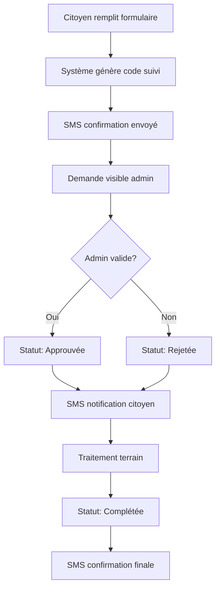
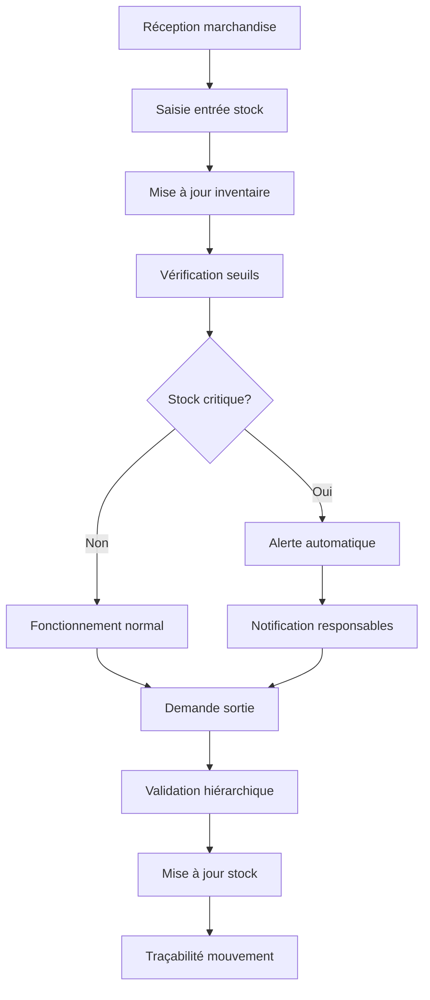
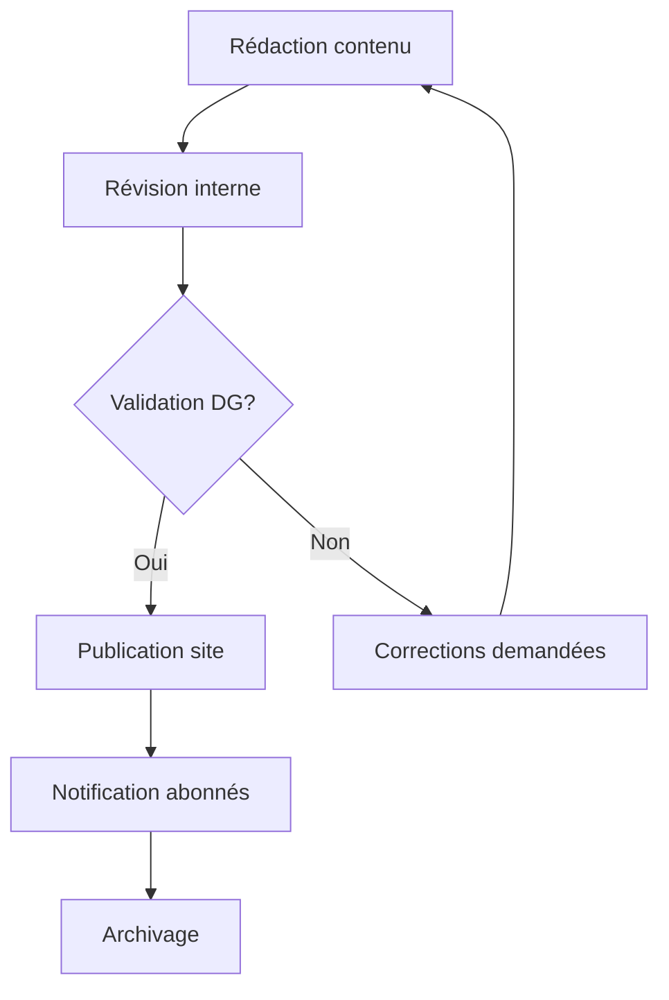

# 📋 CAHIER DES CHARGES - PLATEFORME CSAR

**Commissariat à la Sécurité Alimentaire et à la Résilience**  
*Plateforme Numérique de Gestion Intégrée*

---

## 📄 **INFORMATIONS GÉNÉRALES**

| **Élément** | **Détail** |
|-------------|------------|
| **Nom du projet** | Plateforme CSAR (Commissariat à la Sécurité Alimentaire et à la Résilience) |
| **Client** | Gouvernement du Sénégal - CSAR |
| **Type de projet** | Plateforme web de gestion administrative et publique |
| **Version** | 2.0 |
| **Date de création** | Janvier 2025 |
| **Statut** | En production |

---

## 🎯 **1. CONTEXTE ET OBJECTIFS**

### **1.1 Contexte**

Le Commissariat à la Sécurité Alimentaire et à la Résilience (CSAR) du Sénégal a besoin d'une plateforme numérique intégrée pour :

- **Centraliser** la gestion des stocks alimentaires nationaux
- **Moderniser** les processus administratifs internes
- **Faciliter** l'accès aux services pour les citoyens
- **Améliorer** la transparence et la traçabilité
- **Optimiser** la prise de décision avec des données en temps réel

### **1.2 Objectifs Principaux**

#### **🏛️ Objectifs Institutionnels**
- Digitaliser les processus de gestion interne du CSAR
- Améliorer l'efficacité opérationnelle des équipes
- Assurer la traçabilité complète des opérations
- Faciliter le reporting et le suivi des indicateurs

#### **👥 Objectifs Citoyens**
- Simplifier l'accès aux services du CSAR
- Permettre le suivi transparent des demandes
- Améliorer la communication avec les citoyens
- Offrir des services 24h/24 via la plateforme web

#### **📊 Objectifs Techniques**
- Centraliser toutes les données dans un système unique
- Assurer la sécurité et la confidentialité des données
- Garantir la haute disponibilité du système
- Faciliter la maintenance et les évolutions futures

---

## 🔍 **2. ANALYSE FONCTIONNELLE**

### **2.1 Utilisateurs Cibles**

#### **👤 Utilisateurs Internes**

| **Profil** | **Rôle** | **Accès** | **Permissions** |
|------------|----------|-----------|-----------------|
| **Administrateur** | Gestionnaire système | `/admin` | Accès complet, CRUD toutes entités |
| **Directeur Général** | Direction exécutive | `/dg` | Consultation, rapports, statistiques |
| **Responsable Entrepôt** | Gestion stocks | `/entrepot` | Gestion stocks de son entrepôt |
| **Agent** | Personnel terrain | `/agent` | Consultation profil personnel |

#### **🌍 Utilisateurs Externes**

| **Profil** | **Accès** | **Services** |
|------------|-----------|--------------|
| **Citoyens** | Site public | Demandes d'aide, suivi, informations |
| **Partenaires** | Site public | Demandes partenariat, informations |
| **Médias** | Site public | Actualités, communications officielles |

### **2.2 Fonctionnalités par Module**

#### **🏠 Module Public (Site Vitrine)**

**Fonctionnalités principales :**
- **Page d'accueil** avec présentation du CSAR
- **Section "À propos"** avec statistiques dynamiques
- **Actualités** et communications officielles
- **Galerie d'images** des missions et activités
- **Carte interactive** des entrepôts et zones d'intervention
- **Formulaires de demande** (aide alimentaire, audience, partenariat)
- **Suivi de demandes** avec code unique
- **Newsletter** et abonnements
- **Contact** et formulaire de message
- **Page partenaires** avec logos et liens

**Spécifications techniques :**
- Design responsive (mobile-first)
- Optimisation SEO
- Accessibilité WCAG 2.1
- Temps de chargement < 3 secondes
- Compatible tous navigateurs modernes

#### **⚙️ Module Administration**

**Dashboard et Statistiques :**
- Vue d'ensemble avec KPI en temps réel
- Graphiques et tableaux de bord interactifs
- Statistiques par région, type de demande, période
- Alertes et notifications importantes
- Export des rapports en PDF/CSV

**Gestion des Demandes :**
- Liste paginée avec filtres avancés
- Validation et traitement des demandes
- Système de commentaires et suivi
- Notifications SMS automatiques
- Géolocalisation sur carte
- Export individuel et groupé en PDF

**Gestion des Stocks :**
- Inventaire en temps réel par entrepôt
- Mouvements d'entrée et sortie
- Alertes de stock critique
- Traçabilité complète des opérations
- Gestion des fournisseurs
- Rapports de rotation des stocks

**Gestion RH :**
- CRUD complet du personnel
- Fiches individuelles avec photo
- Gestion des rôles et permissions
- Présences et pointages
- Bulletins de salaire
- Export PDF des fiches agent

**Gestion de Contenu :**
- Édition du contenu public
- Gestion des actualités
- Modération des commentaires
- Gestion de la galerie d'images
- Configuration des paramètres site

**Partenaires Techniques :**
- CRUD complet des partenaires
- Catégorisation par type (ONG, Institution, Privé)
- Gestion des zones d'intervention
- Statut et mise en avant
- Export et reporting

**Rapports SIM :**
- Création et édition de rapports de marché
- Suivi des prix et tendances
- Publication et archivage
- Export multi-formats

**Alertes de Prix :**
- Système d'alerte automatique
- Seuils configurables par produit
- Notifications en temps réel
- Historique des variations

**Gestion des Tâches :**
- Planification et suivi des tâches
- Attribution aux agents
- Statuts et priorités
- Rappels automatiques

**Agenda Hebdomadaire :**
- Planification des activités
- Vue calendrier
- Synchronisation équipes
- Notifications de changements

#### **📊 Module Directeur Général**

- **Dashboard exécutif** avec indicateurs clés
- **Rapports synthétiques** par région/période
- **Consultation** des demandes importantes
- **Statistiques globales** de performance
- **Vue d'ensemble** des stocks stratégiques

#### **🏭 Module Responsable Entrepôt**

- **Dashboard entrepôt** spécifique
- **Gestion stocks** de son entrepôt uniquement
- **Mouvements** d'entrée/sortie
- **Alertes** de stock critique
- **Géolocalisation** de l'entrepôt

#### **👨‍💼 Module Agent**

- **Profil personnel** (consultation)
- **Téléchargement** fiche PDF
- **Informations** de contact

---

## 🛠️ **3. SPÉCIFICATIONS TECHNIQUES**

### **3.1 Architecture Technique**

#### **Backend**
- **Framework** : Laravel 11
- **Langage** : PHP 8.2+
- **Architecture** : MVC avec Repository Pattern
- **API** : RESTful pour intégrations externes
- **Authentification** : Laravel Breeze + Middleware personnalisés

#### **Frontend**
- **Template Engine** : Blade
- **CSS Framework** : Tailwind CSS + Bootstrap (modules legacy)
- **JavaScript** : Vanilla JS + jQuery (modules existants)
- **Cartes** : Leaflet.js pour géolocalisation
- **Charts** : Chart.js pour graphiques

#### **Base de Données**
- **SGBD Principal** : PostgreSQL 14+
- **ORM** : Eloquent
- **Migrations** : Laravel Migrations
- **Indexation** : Optimisée pour requêtes fréquentes

#### **Services Externes**
- **SMS** : API Orange Developer Sénégal
- **Export PDF** : DomPDF
- **Stockage Fichiers** : Laravel Storage (local + cloud)
- **Cache** : Redis/File selon environnement

### **3.2 Infrastructure**

#### **Environnement de Développement**
- **Serveur Web** : Apache/Nginx
- **PHP** : 8.2+ avec extensions requises
- **Base de données** : PostgreSQL 14+
- **Outils** : Composer, NPM, Artisan

#### **Environnement de Production**
- **Serveur** : VPS/Cloud avec SSL/TLS
- **Monitoring** : Logs centralisés
- **Sauvegarde** : Automatisée quotidienne
- **CDN** : Pour optimisation des assets

### **3.3 Sécurité**

#### **Authentification et Autorisation**
- **Multi-niveaux** : 4 types d'utilisateurs
- **Sessions sécurisées** avec timeout
- **Protection CSRF** sur tous formulaires
- **Validation** stricte des données entrantes

#### **Protection des Données**
- **Chiffrement** des mots de passe (bcrypt)
- **Sanitisation** des entrées utilisateur
- **Protection SQL Injection** via Eloquent
- **Headers sécurisés** (HSTS, X-Frame-Options)

#### **Audit et Traçabilité**
- **Logs** de toutes les actions critiques
- **Traçabilité** des modifications de données
- **Historique** des connexions
- **Alertes** de sécurité

---

## 📊 **4. MODÈLE DE DONNÉES**

### **4.1 Entités Principales**

#### **👥 Gestion Utilisateurs**
```sql
-- Users (Utilisateurs système)
users: id, email, role, password, created_at, updated_at

-- Personnel (Agents CSAR)
personnel: id, nom, prenom, telephone, email, poste, warehouse_id, photo
```

#### **🏭 Gestion Entrepôts**
```sql
-- Warehouses (Entrepôts)
warehouses: id, nom, adresse, latitude, longitude, responsable_id, capacite

-- Stock Types (Types de stock)
stock_types: id, nom, unite_mesure, description

-- Stocks (Inventaire)
stocks: id, warehouse_id, stock_type_id, quantite, prix_unitaire, date_expiration

-- Stock Movements (Mouvements)
stock_movements: id, stock_id, type, quantite, motif, user_id, created_at
```

#### **📋 Gestion Demandes**
```sql
-- Public Requests (Demandes publiques)
public_requests: id, type, nom, telephone, adresse, latitude, longitude, 
                 motif, statut, code_suivi, created_at

-- Contact Messages (Messages contact)
contact_messages: id, nom, email, telephone, sujet, message, statut, created_at
```

#### **📰 Gestion Contenu**
```sql
-- News (Actualités)
news: id, titre, contenu, image, auteur_id, publie, created_at

-- Public Contents (Contenu public)
public_contents: id, section, key_name, value, type

-- Gallery Images (Galerie)
gallery_images: id, titre, description, image_url, ordre, actif

-- Newsletter Subscribers (Abonnés newsletter)
newsletter_subscribers: id, email, nom, statut, subscribed_at
```

#### **🤝 Gestion Partenaires**
```sql
-- Technical Partners (Partenaires techniques)
technical_partners: id, nom, organization, type, statut, contact_person,
                   email, telephone, website, logo, intervention_zone,
                   is_featured, position, slug, created_at
```

#### **📊 Rapports et Alertes**
```sql
-- SIM Reports (Rapports SIM)
sim_reports: id, titre, periode, contenu, auteur_id, is_published, created_at

-- Price Alerts (Alertes prix)
price_alerts: id, product_name, market_name, region, previous_price,
              current_price, alert_level, statut, created_at

-- Tasks (Tâches)
tasks: id, titre, description, assigne_a, priorite, statut, echeance, created_at

-- Weekly Agenda (Agenda hebdomadaire)
weekly_agenda: id, titre, description, date_debut, date_fin, participants, created_at
```

#### **🔍 Audit et Historique**
```sql
-- Audit Logs (Logs d'audit)
audit_logs: id, user_id, action, model_type, model_id, old_values,
            new_values, ip_address, user_agent, created_at
```

### **4.2 Relations Principales**

- **User** ←→ **Personnel** (1:1)
- **Warehouse** ←→ **Personnel** (1:n - responsable)
- **Warehouse** ←→ **Stock** (1:n)
- **Stock** ←→ **StockMovement** (1:n)
- **User** ←→ **News** (1:n - auteur)
- **User** ←→ **AuditLog** (1:n)

---

## 🎨 **5. SPÉCIFICATIONS UX/UI**

### **5.1 Identité Visuelle**

#### **Palette de Couleurs**
- **Primaire** : #198754 (Vert CSAR institutionnel)
- **Secondaire** : #0d6efd (Bleu administration)
- **Succès** : #10b981 (Vert validation)
- **Attention** : #f59e0b (Orange alerte)
- **Erreur** : #dc2626 (Rouge erreur)
- **Neutre** : #6b7280 (Gris texte)

#### **Typographie**
- **Police principale** : Inter (Google Fonts)
- **Police secondaire** : System UI fallback
- **Tailles** : Responsive scale (12px → 48px)

#### **Iconographie**
- **Bibliothèque** : Font Awesome 6
- **Style** : Modern, cohérent
- **Format** : SVG pour optimisation

### **5.2 Principes de Design**

#### **Responsive Design**
- **Mobile First** : Conception prioritaire mobile
- **Breakpoints** : 320px, 768px, 1024px, 1440px
- **Navigation** : Hamburger menu sur mobile
- **Touch-friendly** : Boutons min 44px

#### **Accessibilité**
- **Contraste** : Ratio minimum 4.5:1
- **Navigation clavier** : Tab index logique
- **Screen readers** : Attributs ARIA
- **Textes alternatifs** : Sur toutes images

#### **Performance**
- **Lazy loading** : Images et composants
- **Compression** : Assets optimisés
- **Cache** : Headers appropriés
- **CDN** : Pour ressources statiques

### **5.3 Composants UI**

#### **Formulaires**
- **Validation temps réel** : Feedback immédiat
- **États visuels** : Normal, focus, erreur, succès
- **Progressions** : Étapes multiples visibles
- **Auto-save** : Pour formulaires longs

#### **Tableaux de Données**
- **Pagination** : Navigation fluide
- **Tri** : Colonnes cliquables
- **Filtres** : Recherche et critères
- **Export** : PDF, CSV, Excel

#### **Notifications**
- **Toast messages** : Non-intrusives
- **Alertes modales** : Actions critiques
- **Badges** : Compteurs et statuts
- **SMS** : Confirmations automatiques

---

## 🔄 **6. PROCESSUS MÉTIER**

### **6.1 Processus de Demande d'Aide**



### **6.2 Processus de Gestion des Stocks**



### **6.3 Processus de Publication**



---

## 📱 **7. INTÉGRATIONS TECHNIQUES**

### **7.1 API SMS Orange Developer**

#### **Configuration**
```php
// Configuration dans .env
ORANGE_SMS_CLIENT_ID=xxx
ORANGE_SMS_CLIENT_SECRET=xxx
ORANGE_SMS_BASE_URL=https://api.orange.com/smsmessaging/v1/
```

#### **Utilisation**
- **Confirmation demandes** : Envoi automatique code suivi
- **Notifications statut** : Mise à jour progression
- **Alertes urgentes** : Communications critiques
- **Rappels** : Tâches et échéances

### **7.2 API Géolocalisation**

#### **Leaflet.js**
- **Cartes interactives** : Visualisation entrepôts
- **Marqueurs** : Localisation demandes
- **Clusters** : Groupement zones denses
- **Routing** : Calcul itinéraires

#### **Fonctionnalités**
- **Géocodage** : Adresses → Coordonnées
- **Géolocalisation** : Position utilisateur
- **Calcul distances** : Entrepôt le plus proche
- **Zones de service** : Rayons d'intervention

### **7.3 Export et Reporting**

#### **DomPDF**
- **Fiches agents** : Export individuel
- **Rapports demandes** : Synthèses périodiques
- **Inventaires** : États des stocks
- **Bulletins** : Documents officiels

#### **CSV/Excel**
- **Données massives** : Export pour analyse
- **Abonnés newsletter** : Listes marketing
- **Statistiques** : Tableaux de bord

---

## 🔒 **8. SÉCURITÉ ET CONFORMITÉ**

### **8.1 Politique de Sécurité**

#### **Authentification**
- **Mots de passe** : Minimum 8 caractères, complexité
- **Sessions** : Timeout 2h d'inactivité
- **Tentatives** : Blocage après 5 échecs
- **Double authentification** : Pour comptes admin

#### **Autorisation**
- **Principe moindre privilège** : Accès minimum nécessaire
- **Séparation des rôles** : Isolation des responsabilités
- **Révision périodique** : Audit des permissions
- **Traçabilité** : Log de tous accès

### **8.2 Protection des Données**

#### **RGPD/Données Personnelles**
- **Consentement explicite** : Pour newsletter
- **Droit à l'oubli** : Suppression sur demande
- **Portabilité** : Export données personnelles
- **Minimisation** : Collecte strictement nécessaire

#### **Chiffrement**
- **Transport** : HTTPS/TLS 1.3
- **Stockage** : Mots de passe bcrypt
- **Base de données** : Connexions chiffrées
- **Sauvegardes** : Chiffrement AES-256

### **8.3 Plan de Continuité**

#### **Sauvegarde**
- **Fréquence** : Quotidienne automatisée
- **Rétention** : 30 jours local, 1 an distant
- **Tests** : Restauration mensuelle
- **Monitoring** : Alertes échecs

#### **Haute Disponibilité**
- **Uptime** : Objectif 99.5%
- **Redondance** : Serveurs multiples
- **Load balancing** : Répartition charge
- **Monitoring** : Supervision 24/7

---

## 📈 **9. PERFORMANCES ET MONITORING**

### **9.1 Objectifs de Performance**

| **Métrique** | **Objectif** | **Critique** |
|--------------|--------------|--------------|
| **Temps de chargement** | < 3 secondes | < 5 secondes |
| **Time to First Byte** | < 200ms | < 500ms |
| **Core Web Vitals** | Tous verts | Aucun rouge |
| **Disponibilité** | 99.5% | 99% |
| **Concurrent users** | 100 | 500 |

### **9.2 Monitoring**

#### **Métriques Techniques**
- **Temps de réponse** par endpoint
- **Erreurs** 4xx/5xx
- **Utilisation** CPU/RAM/Disque
- **Connexions** base de données

#### **Métriques Métier**
- **Demandes** soumises/jour
- **Taux validation** demandes
- **Utilisation** par module
- **Satisfaction** utilisateurs

### **9.3 Optimisations**

#### **Frontend**
- **Minification** CSS/JS
- **Compression** images WebP
- **Lazy loading** composants
- **Cache** browser optimisé

#### **Backend**
- **Cache** requêtes fréquentes
- **Optimisation** queries SQL
- **Index** base de données
- **Queue** tâches asynchrones

---

## 🚀 **10. DÉPLOIEMENT ET MAINTENANCE**

### **10.1 Environnements**

#### **Développement**
- **Local** : XAMPP/WAMP
- **Outils** : Git, Composer, NPM
- **Base** : SQLite/PostgreSQL
- **Debug** : Activé complet

#### **Staging**
- **Serveur** : Clone production
- **Tests** : Automatisés
- **Données** : Anonymisées
- **Access** : Équipe technique

#### **Production**
- **Serveur** : VPS/Cloud optimisé
- **SSL** : Certificat valide
- **Monitoring** : Actif
- **Sauvegardes** : Automatisées

### **10.2 Procédures de Déploiement**

#### **Checklist Pré-déploiement**
- [ ] Tests unitaires passés
- [ ] Tests d'intégration validés
- [ ] Code review approuvé
- [ ] Sauvegarde base données
- [ ] Plan de rollback prêt

#### **Déploiement**
```bash
# 1. Mise en maintenance
php artisan down

# 2. Git pull
git pull origin main

# 3. Dépendances
composer install --no-dev --optimize-autoloader

# 4. Migrations
php artisan migrate --force

# 5. Cache
php artisan config:cache
php artisan route:cache
php artisan view:cache

# 6. Assets
npm run production

# 7. Remise en service
php artisan up
```

### **10.3 Plan de Maintenance**

#### **Maintenance Préventive**
- **Quotidienne** : Vérification logs erreurs
- **Hebdomadaire** : Test sauvegardes
- **Mensuelle** : Mise à jour sécurité
- **Trimestrielle** : Audit complet

#### **Maintenance Corrective**
- **Procédure** : Escalade définie
- **SLA** : Correction < 4h critique
- **Communication** : Notification parties prenantes
- **Post-mortem** : Analyse incidents

---

## 📋 **11. LIVRABLES**

### **11.1 Documentation Technique**

#### **Code Source**
- [ ] Application Laravel complète
- [ ] Base de données avec seeders
- [ ] Tests unitaires et d'intégration
- [ ] Configuration environnements

#### **Documentation**
- [ ] **README.md** : Installation et configuration
- [ ] **API Documentation** : Endpoints et exemples
- [ ] **Guide Administrateur** : Utilisation modules
- [ ] **Guide Utilisateur** : Interface publique

#### **Scripts et Outils**
- [ ] **Scripts déploiement** : Automatisation
- [ ] **Scripts sauvegarde** : Procédures
- [ ] **Monitoring** : Dashboards
- [ ] **Scripts maintenance** : Tâches récurrentes

### **11.2 Environnements Livrés**

#### **Environnement de Production**
- [ ] Serveur configuré et sécurisé
- [ ] SSL/TLS configuré
- [ ] Monitoring actif
- [ ] Sauvegardes programmées

#### **Environnement de Staging**
- [ ] Clone production
- [ ] Données test
- [ ] Accès équipe
- [ ] Tests automatisés

### **11.3 Formation et Support**

#### **Formation Utilisateurs**
- [ ] **Session Admin** : Gestion complète (8h)
- [ ] **Session DG** : Consultation et rapports (2h)
- [ ] **Session Responsables** : Gestion stocks (4h)
- [ ] **Support** : 3 mois inclus

#### **Documentation Utilisateur**
- [ ] **Manuels** : Par profil utilisateur
- [ ] **Tutoriels vidéo** : Opérations fréquentes
- [ ] **FAQ** : Questions communes
- [ ] **Contacts support** : Procédures escalade

---

## 💰 **12. BUDGET ET PLANNING**

### **12.1 Estimation Budgétaire**

#### **Développement Initial**
| **Poste** | **Détail** | **Coût** |
|-----------|------------|----------|
| **Analyse et Conception** | UX/UI, Architecture | 15% |
| **Développement Backend** | Laravel, API, BDD | 40% |
| **Développement Frontend** | Interface utilisateur | 25% |
| **Intégrations** | SMS, Cartes, Exports | 10% |
| **Tests et Débogage** | QA, Tests utilisateurs | 10% |

#### **Coûts Récurrents Annuels**
| **Poste** | **Coût Mensuel** | **Coût Annuel** |
|-----------|------------------|-----------------|
| **Hébergement** | 50-200€ | 600-2400€ |
| **Domaine et SSL** | - | 50-150€ |
| **Monitoring** | 20-50€ | 240-600€ |
| **SMS Orange** | Variable usage | 100-500€ |
| **Maintenance** | 200-500€ | 2400-6000€ |

### **12.2 Planning Prévisionnel**

#### **Phase 1 : Conception (2 semaines)**
- Analyse fonctionnelle détaillée
- Maquettes UX/UI complètes  
- Architecture technique finalisée
- Spécifications validées

#### **Phase 2 : Développement Core (6 semaines)**
- Setup environnement et CI/CD
- Authentification et autorisations
- Modules de base (Users, Dashboard)
- Tests unitaires

#### **Phase 3 : Modules Métier (8 semaines)**
- Gestion des demandes
- Gestion des stocks
- Interface publique
- Intégrations (SMS, Cartes)

#### **Phase 4 : Finalisation (4 semaines)**
- Tests d'intégration complets
- Optimisations performance
- Documentation utilisateur
- Formation équipes

#### **Phase 5 : Déploiement (2 semaines)**
- Setup environnement production
- Migration données existantes
- Tests acceptance utilisateur
- Go-live et support initial

**📅 DURÉE TOTALE : 22 semaines (5,5 mois)**

---

## 🎯 **13. CRITÈRES D'ACCEPTATION**

### **13.1 Critères Fonctionnels**

#### **Interface Publique**
- [ ] Formulaires de demande fonctionnels
- [ ] Système de suivi opérationnel
- [ ] Carte interactive avec géolocalisation
- [ ] Newsletter et abonnements
- [ ] Responsive design validé

#### **Interface Administration**
- [ ] CRUD complet toutes entités
- [ ] Système d'authentification sécurisé
- [ ] Dashboard avec statistiques temps réel
- [ ] Export PDF/CSV fonctionnel
- [ ] Notifications SMS opérationnelles

#### **Gestion des Stocks**
- [ ] Inventaire temps réel
- [ ] Alertes de stock critique
- [ ] Traçabilité des mouvements
- [ ] Rapports détaillés
- [ ] Géolocalisation entrepôts

### **13.2 Critères Techniques**

#### **Performance**
- [ ] Temps de chargement < 3 secondes
- [ ] Support 100 utilisateurs simultanés
- [ ] Disponibilité > 99%
- [ ] Sauvegarde automatique quotidienne

#### **Sécurité**
- [ ] HTTPS obligatoire
- [ ] Authentification multi-niveaux
- [ ] Protection CSRF active
- [ ] Logs d'audit complets

#### **Compatibilité**
- [ ] Navigateurs modernes (Chrome, Firefox, Safari, Edge)
- [ ] Responsive mobile/tablette
- [ ] API RESTful documentée
- [ ] Intégration SMS Orange

### **13.3 Critères Qualité**

#### **Code**
- [ ] Standards PSR-12 respectés
- [ ] Couverture tests > 70%
- [ ] Documentation code complète
- [ ] Pas de vulnérabilités critiques

#### **UX/UI**
- [ ] Design cohérent et moderne
- [ ] Navigation intuitive
- [ ] Accessibilité WCAG 2.1 AA
- [ ] Validation utilisateurs finaux

---

## 📞 **14. SUPPORT ET ÉVOLUTIONS**

### **14.1 Support Initial**

#### **Période de Garantie : 3 mois**
- **Support technique** : Résolution bugs
- **Hotline** : Assistance utilisateurs
- **Corrections** : Mises à jour correctives
- **Formation** : Sessions complémentaires

#### **SLA Support**
- **Critique** : Réponse < 2h, Résolution < 8h
- **Important** : Réponse < 4h, Résolution < 24h  
- **Normal** : Réponse < 8h, Résolution < 72h
- **Mineur** : Réponse < 24h, Résolution < 1 semaine

### **14.2 Évolutions Futures**

#### **Phase 2 - Améliorations (6 mois)**
- **Application mobile** dédiée
- **Dashboard avancé** avec IA
- **Intégrations** systèmes externes
- **Workflow** automatisé

#### **Phase 3 - Expansion (12 mois)**
- **Multi-tenancy** pour autres institutions
- **API publique** développeurs tiers
- **Analytics avancés** et prédictions
- **Portail partenaires** dédié

### **14.3 Maintenance Long Terme**

#### **Contrat de Maintenance Annuel**
- **Mises à jour** sécurité mensuelles
- **Évolutions** fonctionnelles mineures
- **Monitoring** et supervision
- **Support** technique continu
- **Sauvegardes** et récupération

---

## ✅ **15. VALIDATION ET APPROBATION**

### **15.1 Parties Prenantes**

| **Rôle** | **Responsabilité** | **Validation** |
|----------|-------------------|----------------|
| **Directeur CSAR** | Validation stratégique | Objectifs métier |
| **DSI** | Validation technique | Architecture système |
| **Responsable Admin** | Validation fonctionnelle | Processus métier |
| **Utilisateurs Finaux** | Tests d'acceptation | Ergonomie usage |

### **15.2 Jalons de Validation**

#### **Validation Conception**
- [ ] Cahier des charges approuvé
- [ ] Maquettes UX/UI validées
- [ ] Architecture technique approuvée
- [ ] Planning et budget confirmés

#### **Validation Développement**
- [ ] MVP présenté et validé
- [ ] Tests utilisateurs réalisés
- [ ] Performance validée
- [ ] Sécurité auditée

#### **Validation Déploiement**
- [ ] Recette utilisateur complète
- [ ] Formation équipes réalisée
- [ ] Documentation livrée
- [ ] Go-live approuvé

### **15.3 Signatures**

| **Nom** | **Fonction** | **Date** | **Signature** |
|---------|--------------|----------|---------------|
| | **Directeur Général CSAR** | | |
| | **Directeur Technique** | | |
| | **Chef de Projet** | | |
| | **Responsable Qualité** | | |

---

## 📄 **ANNEXES**

### **Annexe A : Modèle de Données Détaillé**
*[Schéma ERD complet avec toutes les relations]*

### **Annexe B : Maquettes UX/UI**
*[Wireframes et maquettes haute-fidélité]*

### **Annexe C : Spécifications API**
*[Documentation endpoints REST avec exemples]*

### **Annexe D : Plan de Tests**
*[Stratégie et scénarios de tests détaillés]*

### **Annexe E : Guide d'Installation**
*[Procédures step-by-step déploiement]*

---

**📋 FIN DU CAHIER DES CHARGES**

*Version 2.0 - Janvier 2025*  
*© Plateforme CSAR - Gouvernement du Sénégal*

